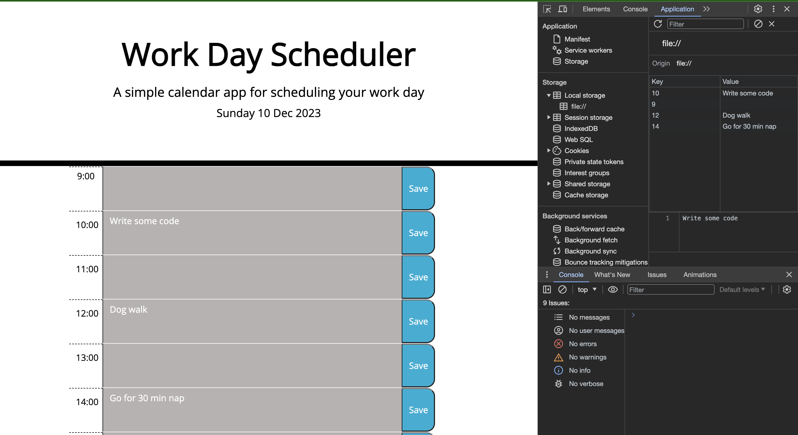

# Daily Planner

## Description 

A simple calendar application that allows a user to save events for each hour of the day. This app runs in the browser and feature dynamically updated HTML and CSS powered by jQuery.

Daily planner features daily updayes date powere by Day.js, and each column with hours and tasks is colorcoded and dinamicyly updates depening on the time of the day. 

This calendar will store your tasks until you delete them and save the the event was deleted. 

## Installation

This app runs in the browser and feature dynamically updated HTML and CSS powered by jQuery.

To access the Daily Planner [follow the link](https://porlowska.github.io/daily-planner/).

You can update each texfiled to add your tasks, and when you press sabe button they will be stored until you delete them. 

## Usage 

This app can be used by any person who would like to add impirtant events and time track their day, so they can manage their day efficently. 

## Credits

N/A

## License

MIT License

